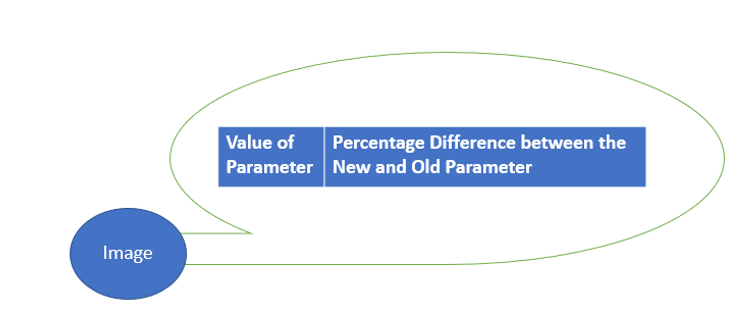
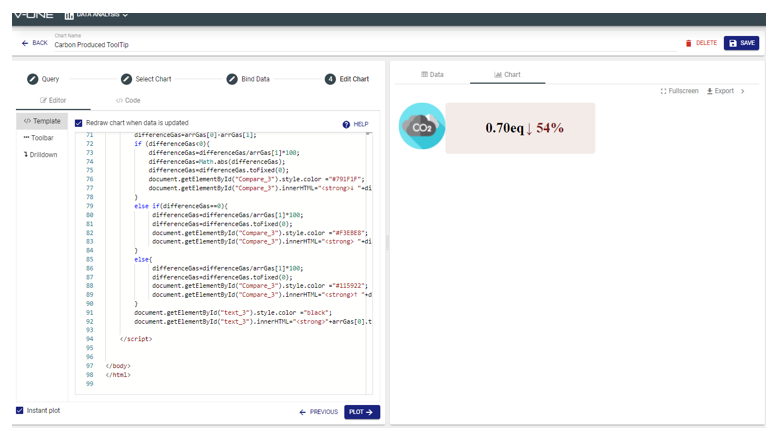

# Data-Visualization-Using-Tooltip
This simple code utilizes a Tooltip for data visualization by placing a table inside the tooltip to display the data.

# Concept

By implementing the tooltip function on images, we can manipulate the contents of the tooltip by putting in a table and only using the table header to put the contents that we want in it. As the result, we will be able to simulate a reactive chart when the user hovers over an image and it will visualize the data according to the image that they hover on. 

# Sample Output

